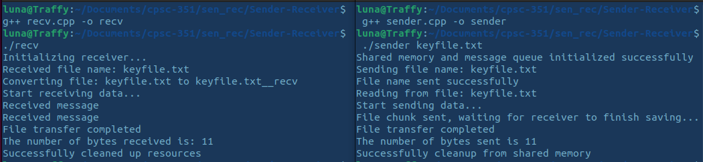

# Project 1 - Sender & Receiver
  
  **Overview**: Implementation of two programs, a `sender.cpp` and `receiver.cpp` program, which synchronously transfers files between two processes using our knowledge of shared memory and message queues.

  - Programming language used: C++

## Team Members:

 | **Name** | **Email** | **Section Number** |
 | :---: | :---: | :-----------: |
 | Toan Tran | <ttran8276@csu.fullerton.edu> | CPSC 351-01 10882 |
 | Hyndavi Teegela | <hyndavi.teegela@csu.fullerton.edu> | CPSC 351-01 10882 |
 | Michelle Pham | <mp28jam@csu.fullerton.edu> | CPSC 351-01 10882 |
 | Natalia Garcia | <natgarcia@csu.fullerton.edu> | CPSC 351-01 10882 |

## To Compile:
 
 - This program compiles in a linux environment:

 > Beforehand, make sure to have `make` and `g++` insalled.
 > If they're not installed, type `sudo apt install` followed by `make` and `g++`.

 1. First, type `make` & enter to make sure everything is up to date
 2. Next, type `g++ recv.cpp -o recv` & enter 
 3. Then, type `./recv` & enter (don't terminate program)
 4. Afterward, open a separate terminal window and type `g++ sender.cpp -o sender` & enter
 5. Finally, type `./sender` & enter
 
 - *Below is a screenshot testing our program when it compiles:*

 

## Contributions

 * **Toan Tran** - worked on `sender.cpp` and `recv.cpp`, created `.txt`, & testing
 * **Hyndavi Teegela** - worked on `sender.cpp`, `recv.cpp` & documentation
 * **Michelle Pham** - worked on documentation & other code
 * **Natalia Garcia** - worked on `README.md` file & other code

__________________________________________________________________