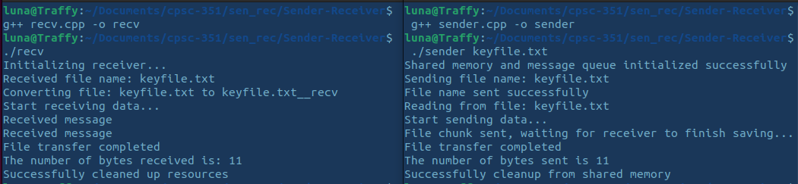

## Overview

An implementation of two programs — `sender.cpp` and `recv.cpp` — that synchronously transfer files between two processes using **System V shared memory** and **message queues** in Linux.

The sender reads a file in chunks, writes each chunk into a shared memory segment, and notifies the receiver via a message queue. The receiver reads the chunk from shared memory, saves it to a new file (appended with `__recv`), and sends an acknowledgment back. This handshake repeats until the entire file is transferred.

- **Programming Language**: C++
- **IPC Mechanisms**: System V Shared Memory (`shmget`/`shmat`) and Message Queues (`msgget`/`msgsnd`/`msgrcv`)
- **Synchronization**: Message-based handshake (sender waits for receiver's acknowledgment after each chunk)

## Prerequisites

- A **Linux** environment (or WSL on Windows)
- `g++` (GNU C++ compiler)
- `make` (build automation tool)

To install the prerequisites on Ubuntu/Debian:

```bash
sudo apt update
sudo apt install g++ make
```

---

## How It Works

1. The **receiver** (`recv.cpp`) starts first. It:

   - Creates a shared memory segment (1,000 bytes per chunk) and a message queue using `ftok("keyfile.txt", 'a')`.
   - Installs a signal handler for `SIGINT` (Ctrl+C) that cleans up IPC resources before exiting.
   - Waits for the file name from the sender.
2. The **sender** (`sender.cpp`) starts second with a file name as an argument. It:

   - Connects to the existing shared memory and message queue (using the same key).
   - Sends the file name to the receiver via a `fileNameMsg` (type `FILE_NAME_TRANSFER_TYPE`).
   - Reads the file chunk by chunk (up to `SHARED_MEMORY_CHUNK_SIZE` bytes per iteration), writes each chunk into shared memory, and sends a `message` (type `SENDER_DATA_TYPE`) with the chunk size.
   - Waits for an `ackMessage` (type `RECV_DONE_TYPE`) from the receiver before sending the next chunk.
   - When the file is fully read, sends a final message with `size = 0` to signal completion.
3. The **receiver** loops:

   - Reads each chunk from shared memory and writes it to a new file named `<original_filename>__recv`.
   - Sends an acknowledgment back to the sender after saving each chunk.
   - Stops when it receives a message with `size = 0`, then cleans up IPC resources.

### Message Structures (defined in `msg.h`)

| Struct          | Purpose                                          | Fields                              |
| :-------------- | :----------------------------------------------- | :---------------------------------- |
| `fileNameMsg` | Sends the file name from sender to receiver      | `mtype`, `fileName[100]`        |
| `message`     | Notifies receiver of data ready in shared memory | `mtype`, `size` (bytes to read) |
| `ackMessage`  | Acknowledges that a chunk was saved              | `mtype`                           |

### Message Types

|            Macro            | Value | Description                          |
| :-------------------------: | :---: | :----------------------------------- |
|    `SENDER_DATA_TYPE`    |   1   | Data chunk is ready in shared memory |
|     `RECV_DONE_TYPE`     |   2   | Receiver has saved the chunk         |
| `FILE_NAME_TRANSFER_TYPE` |   3   | File name is being transferred       |

---

## Compilation & Execution

### Step 1: Compile

Use the provided `Makefile` to build both executables:

```bash
make
```

This produces two binaries: `sender` and `recv`.

> **Note**: The Makefile handles both compilation (`g++ -c`) and linking (`g++ -o`) automatically. To clean up object files and binaries, run:
>
> ```bash
> make clean
> ```

### Step 2: Run the Receiver

Open **Terminal 1** and start the receiver:

```bash
./recv
```

Keep this terminal running — the receiver will wait for the sender to connect.

### Step 3: Run the Sender

Open **Terminal 2** and run the sender with a file name:

```bash
./sender <filename>
```

For example:

```bash
./sender largefile.txt
```

The sender will transfer the file chunk by chunk. The receiver saves the received data as `<filename>__recv` (e.g., `largefile.txt__recv`).

> **Important**: The receiver must be started **before** the sender, since the receiver creates the shared memory and message queue.

---

## Testing



The screenshot above shows the sender and receiver running concurrently in two terminals, demonstrating a successful file transfer.

### Sample Run

```
Terminal 1 (receiver)          Terminal 2 (sender)
─────────────────────────────  ─────────────────────────────
./recv                         ./sender largefile.txt
Initializing receiver...
                               Shared memory and message
                               queue initialized successfully
                               Sending file name: largefile.txt
                               File name sent successfully
Received file name: largefile.txt
Converting file: largefile.txt
  to largefile.txt__recv
Start receiving data...        Reading from file: largefile.txt
                               Start sending data...
                               File chunk sent, waiting...
Received message               (continues...)
...                            ...
File transfer completed        File transfer completed
Successfully cleaned up
The number of bytes received   The number of bytes sent
  is: 4082                       is: 4082
```

---

## Files

| File                  | Description                                                                             |
| :-------------------- | :-------------------------------------------------------------------------------------- |
| `sender.cpp`        | Source code for the sender process                                                      |
| `recv.cpp`          | Source code for the receiver process                                                    |
| `msg.h`             | Header file with message structures and constants                                       |
| `Makefile`          | Build automation script                                                                 |
| `keyfile.txt`       | Contains`Hello World` — used by `ftok()` to generate a unique IPC key              |
| `signaldemo.cpp`    | Example program demonstrating signal handling (used as a reference for Ctrl+C handling) |
| `scsh_test.png`     | Screenshot of a successful test run                                                     |
| `largefile.txt`     | Sample file for testing                                                                 |
| `keyfile.txt__recv` | Example output: received copy of`keyfile.txt`                                         |

---

## Cleanup

The receiver automatically cleans up shared memory and the message queue on normal exit or when **Ctrl+C** is pressed.

To manually remove compiled binaries and object files:

```bash
make clean
```

To manually remove leftover IPC resources (if needed):

```bash
ipcrm -M <shm_key>   # Remove shared memory segment
ipcrm -Q <msg_key>   # Remove message queue
```

---

## Contributions

| Team Member               | Contributions                                                                  |
| :------------------------ | :----------------------------------------------------------------------------- |
| **Toan Tran**       | Worked on`sender.cpp` and `recv.cpp`, created `.txt` test files, testing |
| **Hyndavi Teegela** | Worked on`sender.cpp`, `recv.cpp`, and documentation                       |
| **Michelle Pham**   | Worked on documentation and other code                                         |
| **Natalia Garcia**  | Worked on`README.md` file and other code                                     |

---

## Reflections

This project demonstrated practical interprocess communication using System V IPC primitives. Key challenges included:

- Coordinating the **sender/receiver handshake** to avoid race conditions when reading/writing shared memory.
- Properly **initializing and cleaning up** IPC resources to prevent orphaned segments or queues.
- Handling **Ctrl+C** gracefully — the receiver's signal handler ensures all resources are deallocated on interruption.

The project reinforced core OS concepts: process synchronization, mutual exclusion via message queues, and efficient data transfer using shared memory.
